

# Introduction
In this project, I will design a three-tier architecture web application for Circle Wash laundromat to increase customer loyalty, internal business productivity, and the operation's credibility. First, based on online reviews, customers have trouble filing complaints after business hours and experience difficulty getting a refund for machine malfunction. The website will provide fair online customer service handling customers' complaints. Increase internal business productivity; the website would offer scheduling services for picking up and dropping off laundries, eliminating staff picking up calls, and manually scheduling each laundry delivery. In addition, the scheduling service would provide an optimal delivery route for the driver to increase productivity. Lastly, the operation's policies and information are currently present to customers in posters scattered around the laundromat. A website can unify the details and communicate information clearly to the customers.

# Use Case
This website contains two main systems: Customer Service, Scheduling & Delivery System. Each system has a targeted use case demonstrated below. 

## Customer Service
1. Entry point:
    - Laundromat customer who encountered machine malfunction after business hour where there’s no staff for assistance
    - Laundromat customers who encountered machine malfunction that requires verification on the machine history
2. Handle complaint:
    - Users with smartphone and Internet access may file a complaint through a QR code or web link (displayed in-store). 
    - Users without a smartphone or Internet access may file a complaint through a paper complaint form (located around the main office).
3. Enter Online Complaint Form:
    - Users with an existing account would be asked to log in before filing a report.
    - The user without a laundromat account would be provided with two options:
        - Option 1: Create an account then file a complaint
        - Option 2: file a complaint as a guess
4. Filing Online Complaint Form:
    - The user would need to provide machine number, machine type, amount of money request for return, payment type on the machine, details on the type of payment(FasCard number or Credit card last 4 digits), preferred refund option (cash or in-store credit)  and describe the problem.
        - Users with an existing account would have their contact info prefilled
        - A user without an account would need to manually enter their contact info
    - The web app would record the data user-provided, and the user’s location, the user submits time by default.
5. Administrative Portal:
    - There are two types of accounts: owner (have power on processing complaints and refund), staff (power on processing complaints only)
    - Each action performed by who in the administrative portal would be recorded into the database
6. Review:
    - When a complaint is filed, laundromat staff who have access to the administrative portal would receive an email notification on the name of the complaints, and the total number of unreviewed complaints.
    - On the administrative portal, a real-time notification pop-up would be sent to the administrative all-opened dashboard page, and the new complaint would be displayed in real-time in the complaint list. (using WebSocket connect between dashboard and backend server)
    - On the complaint page, the owner and staff have access to the information on the complaints and machine history regarding the complaint.
7. Approval Process: 
    - Once the staff or owner reviews the complaint by comparing the complaint detail with the machine history, they can approve the complaint.
        - If the complaint does not require a refund an email will be sent to the customer for an update
        - If a staff approve a complaint that requires a refund
            - An email notification would be sent to the owner, letting him know the complaint name and the total number of refund requests.
        - If the owner approves a complaint that requires a refund, the app would redirect him to the refund page.
8. Deny Process:
    - Once the staff or owner reviews the complaint and found no fault.
        - An email would be sent to the customer providing evidence.
9. Could not Identify Complaint:
    - Once the staff or owner reviews the complaint and cannot approve or deny the complaint
        - If a customer provides incorrect information
            - staff can request more information from the customer through an email.
        - If the machine failed to record machine data
            - An email would be sent to the owner updating him on the situation.
            - The owner can manually check the camera 
                - Then redirect the complaint to the approval process, deny process, or request more info process.
10. Refund Process:
    - Once the refund is approved, the owner can approve the refund on the refund page.
    - The owner can refund the customer by their preferred refund method mentioned in the report form. 
        - Cash: an email would be sent to the customer updating him on the situation and acknowledging him that he can pick up his refund in the laundromat during business hour
        - In-Store Credit (AKA FasCard credit):
            - If they user-provided their Fascard number, the owner can add value to their fascard, and update them with an email.
            - If the user does not have a fascard, the owner can refund them instore credit with a new fascard with the value of (refund value minus fascard card value($ 1)). In addition, an email would be sent to acknowledge the customer that his complaint is approved and he can pick up his fascard in the laundromat during business hours. 
11. Possible Outcome: 
    - There are six possible outcomes in this use case and it’s all highlighted in the section above.
    - The six possible outcomes (described in mathematical operations):
        - Complaint approved + no refund = apology email
        - Complaint approved + cash refund = apology email + cash refund
        - Complaint approved + existing FasCard refund = apology email + FasCard credit
        - Complaint approved + new fascard refund = apology email + fascard Card + fascard credit
        - Complaint denied = apology email + evidence
        - The complaint can’t be approved or denied = apology email + requesting more info

**System:** Customer Service

**Primary actor:** Circle Wash Customers (middle age, limited knowledge of tech) 

**Secondary actor:** Circle Wash Staff/Owner 

**Scenario:** An middle-aged woman with limited knowledge of technology experience could not start a washer after coins are inserted. (look for contact malfunction, the possible direction in-store) She open the Circle Wash Website and navigated to the customer support page, and choose to file a complaint as a guess by providing her email. Then she submitted the form about the problem, time, machine number, amount of money lose, and the preferred instore credit as a refund. The complaint is sent from the web app to the laundromat internal system waiting for the staff/owner to review. The staff/owner receives the complaints with the machine history query from FasCard API. Finally, the staff verified the accuracy of the complaints and contacted the customer with a refund on his FasCard.  

**Use Case Diagram**
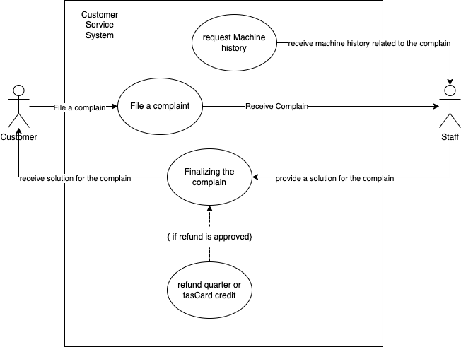

# ERD (Database Diagram)
https://drive.google.com/file/d/1iuYYxyvEE_XokSKLeg9Guhwvez9J0Pwa/view?usp=sharing
This Entity Relationship Diagram below is designed for the administration system and customer service, it does not contain the entity and relationship for the delivery system.
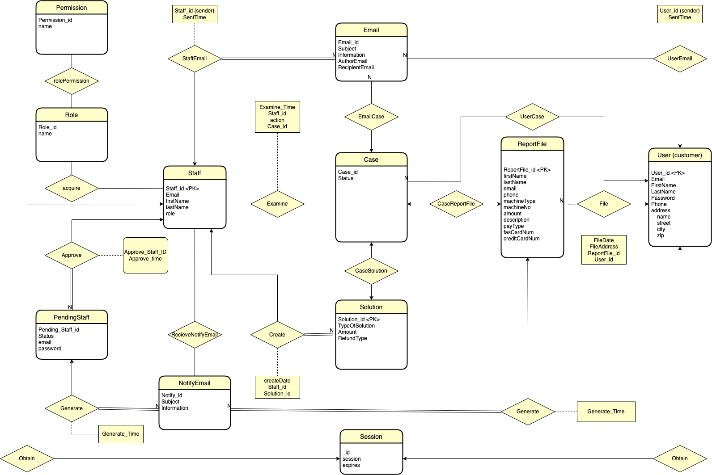

# DataTable
- User(_id, email, firstName, lastName, password, phone, address(name, street, city, zip))
- ReportFile(_id, firstName, lastName, email, phone, machineType, machineNo, amount, description, payType, fasCardNum, creditCardNum, createAt, createAddress, userId)
- fileCase(_id, status, userId, reportFileId, solutionId)
- Email(_id, subject, information, authorEmail, recipientEmail, sentTime, senderType, senderId, fileCaseId)
- Solution(_id, solutionType, amount, refundType, createAt, staffId)
- Staff(_id, email, password, firstName, lastName, role)
- PendingStaff(_id, email, password, status, firstName, lastName, approveStaffId, approveTime)
- NotifyEmail(_id, subject, information, reportFileId, createAt)
- Session(_id, session, expires)
- Examine(_id, staffId, fileCaseId, examineTime, action)
- StaffNotifyEmail(_id, notifyEmailId, staffId)
- Role(_id, name)
- Permission(_id, name)
- rolePermision(_id, roleId, permissionId)
- Acquire(_id, staffId, roleId)

# Sequence Diagram
1. Enter Online Complaint Form
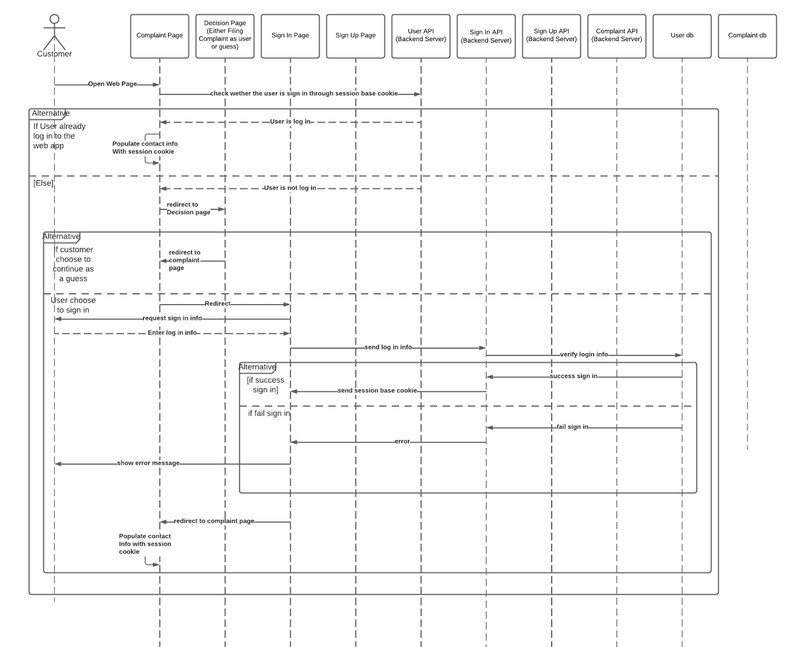

2. Filing Online Complaint Form
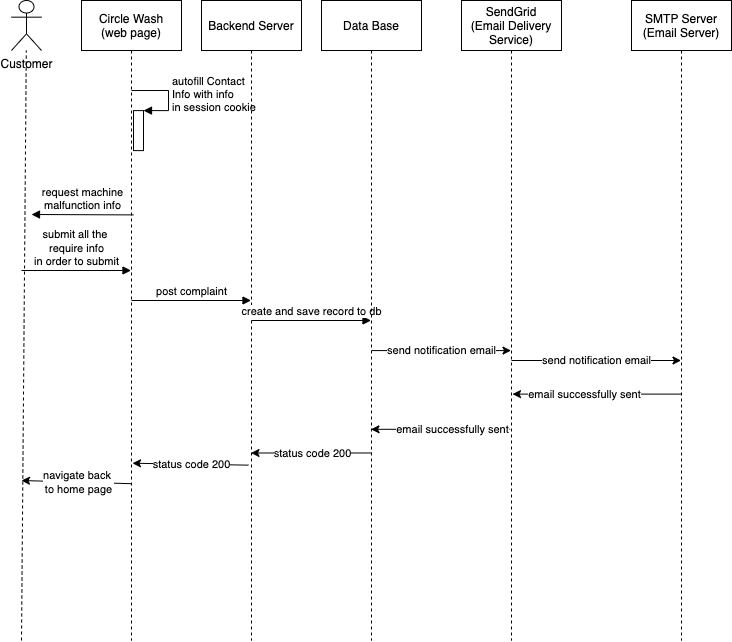

3. Administrative portal sign up & sign in
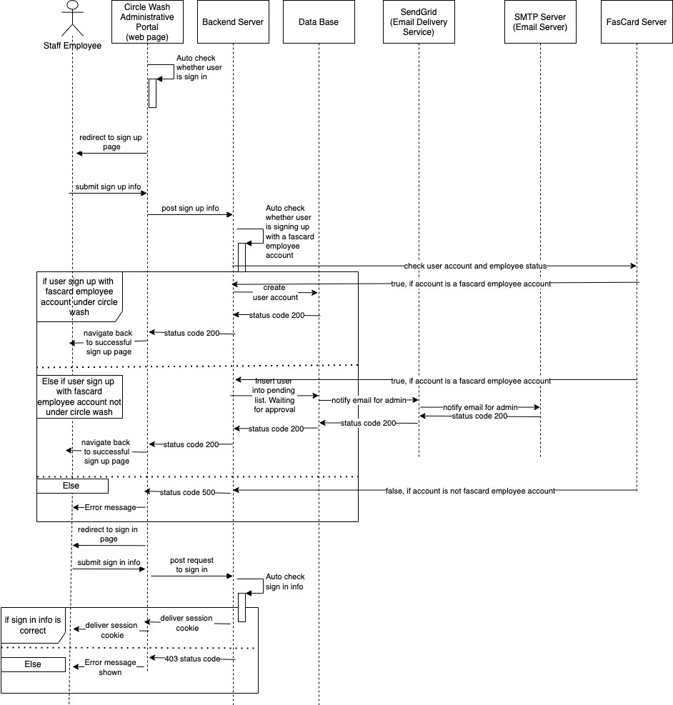

4. Administrative portal manages user role 
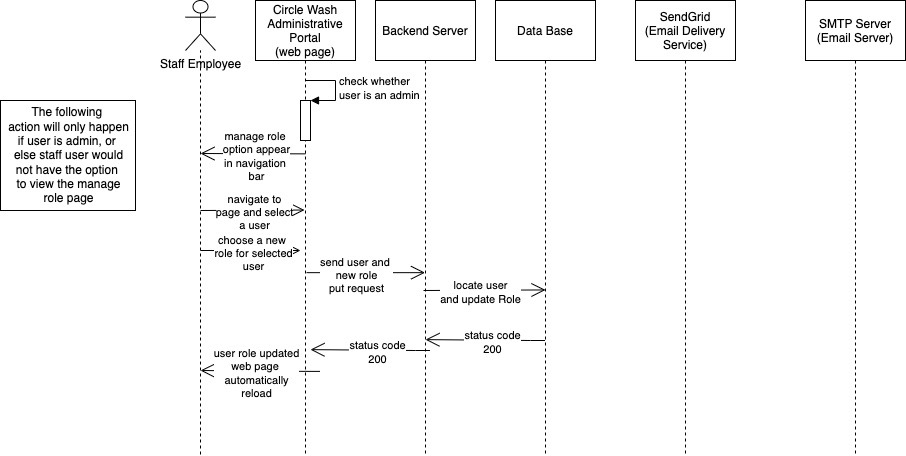

5. Administrative portal approves pending staff
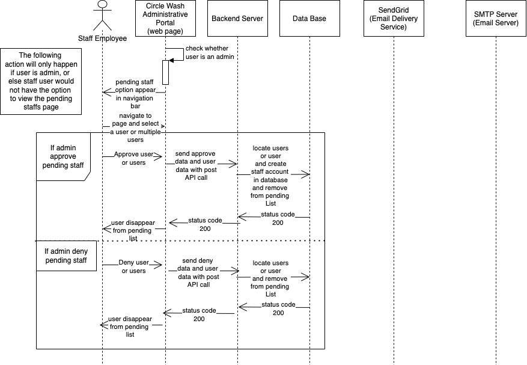

6. Administrative portal handling case
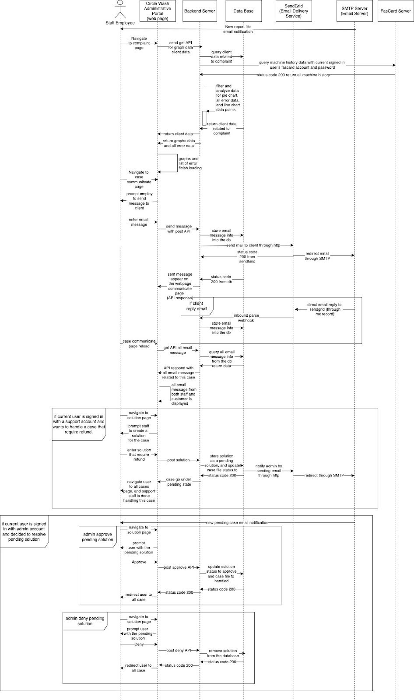

# System Diagram
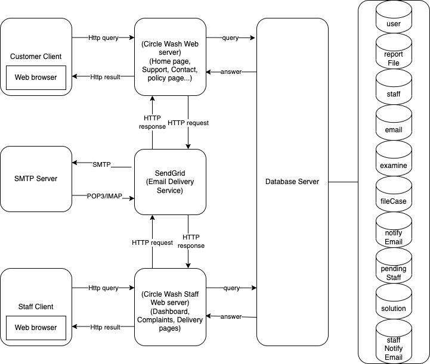

# Permission & Role Design
Circle Wash web app and Circle Wash’s administration portal web app are two separate web applications, so they will have their separate role and permission. For now, there’s only one role in the Circle Wash web app, user, and there’s no permission. In the section below, I will focus on the role and permission for Circle Wash’s administration portal web application. 

Role: 
- Admin
- Support

Permission:
- Page Permission
    - Dashboard Page
    - Pending Staff Sign Up Page
    - Role/Permission Management Page 
    - Individual Report File Page  
    - Individual Case Page (communicate with the customer)
    - Individual Case Solution Page (create a solution for each case)
- Operation Permissions
    - Approve pending staff sign up
    - Edit staff’s role/permission 
    - Create case solution 
    - Create case’s finance solution
    - Communicate with the customer through company email
- Date Permissions
    - N/A

For designing the user and role, I followed the RBAC model, “which uses roles to categorize users and manages permissions for each role. (Licia Li)” I choose this design model over user group permissions, inheriting permissions because the current size of Circle Wash is small and it doesn’t have a large user base, which makes the other models an overkill for this company. However, this model does have its limitations. My RBAC model requires an admin to assign roles to each user or permission to each role, which would be hard to scale up in the future. Assuming Circle Wash grew into a larger corporation with hundreds of staff, it has multiple departments and dozens of permission for each department. Manging roles and permission individually would be come tedious and difficult.

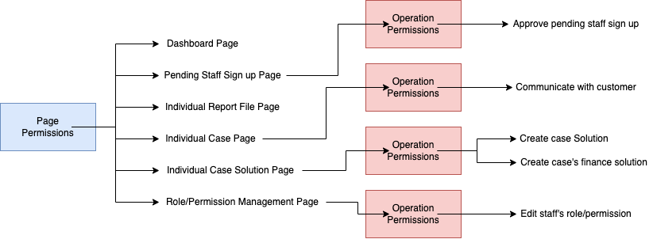

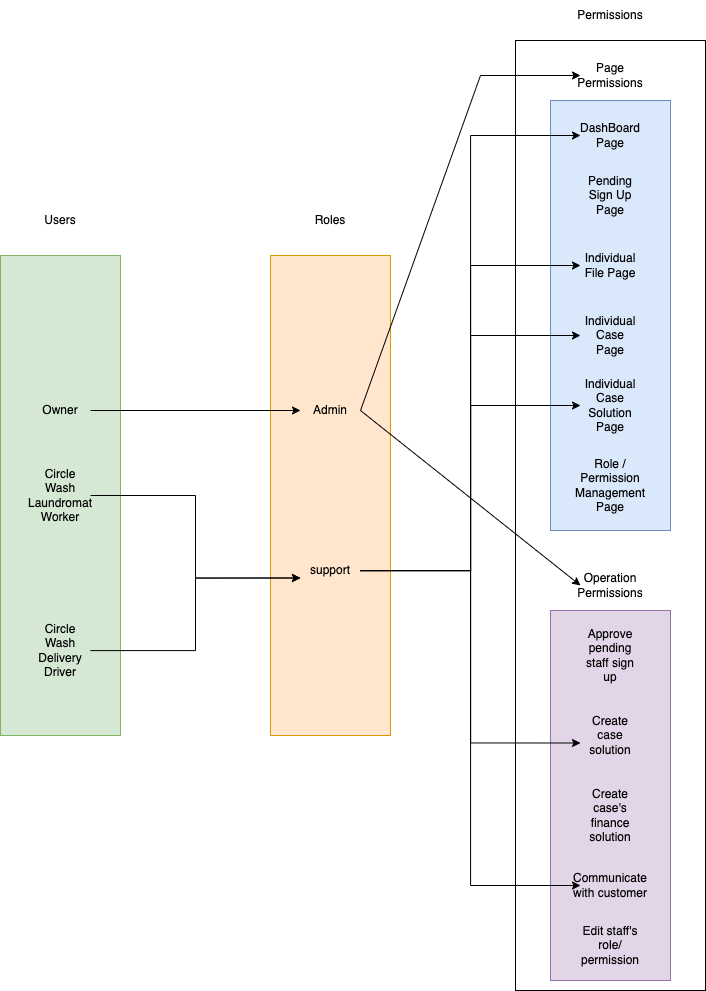

The diagram above is constructed with three main sections: type of user, role, and permissions. I will demonstrate each user’s role and permissions. First, the owner of the corporation has the highest authority, which he/she is assigned to the role of admin. And, the admin has all page and operation permissions. Second, the circle wash laundromat worker and delivery driver have the role of support. Support is capable of viewing the dashboard page, individual report file page, individual case solution page, and individual case page. On the individual case page, support is able to communicate with customers through the customercare@circlewash.net email. On the individual solution page, support is able to create solutions 1, 5, and 6. All the possible solution is shown below.

| Solution number | Solution Details | Solution Result |
| 1 | Complaint approved + no refund | apology email |
| 2 | Complaint approved + cash refund | apology email + cash refund |
| 3 | Complaint approved + existing FasCard refund | apology email + FasCard credit |
| 4 | Complaint approved + new FasCard refund | apology email + FasCard Card + FasCard credit |
| 5 | Complaint denied | apology email + evidence |
| 6 | Complaint can’t be approved or denied | apology email + requesting more info |

# SMTP Server Set Up

## Tech stack
Domain Name Register: I choose to use Google Domain registration for registering the domain name, circlewash.net because it’s the ease of use and competitive pricing.

Server hosting provider: I choose Linode as a cloud hosting provider and share hosted a virtual private cloud because it’s less restrictive compared to aws ec2 (Aws restricted port 25 which is used for SMTP protocol in the mail server and restricted editing reverse domain name. For aws to work, I have to file multiple requests to aws to release the restriction, so I changed to Linode.)

Operating System: Ubuntu 20.04

Control Panel: I choose a cyber panel for the web hosting control panel, and used Cyber Panel’s Openlitespeed software as a control panel because it is capable of generating DNS records and setting up the mail server with a few instructions. 

## Steps
There are two main steps in setting up the mail server. The first part is programming an application that is able to send and receive email properly or setting up the mail server with software. The second part is configuring the DNS record and registering certificates in order to for the mail server to work and increase the domain name authenticity (so the email doesn’t end in a spam folder).

Step 1 (setting up mail server):
- Register domain name
- Register VPC at Linode (cloud hosting provider)
- Install Ubuntu 20.04 in VPC
- Install CyberPanel with no virtual database (The mail server is currently using a local database during the development stage)
- Log in to Cyberpanel admin website

Step 2 (setting up DNA record):
- Create an empty website in Cyberpanel (with a subdomain of www) for creating DNS record in Cyberpanel
- Create two custom name server named ns1 and ns2; hosted inside of the same VPC. Cyber automatically generates all the DNA records for the mail server. The generated DNA records:
    - Type A record for mail server public address, mail.circlewash.net, with VPC public IP as the value.
    - Two Type A record ns1 and ns2 name servers with the same VPC public IP as the value. In the future, it would be more secure to host the name server on different IP addresses because ns2 acts as a backup server for ns1. In the current situation, both name servers would fail at the same time. 
    - Three Cname records, one for the www.circlewash.net website, one for the www.mail.circlewash.net mail server, and an FTP Cname record for all the file transfer protocols. Cname record is used to map a subdomain to a domain host.
    - MX record named circlewash.net with value mail.circlewash.net. The usage of this record is for providing information for the SMTP protocol on how messages should be routed between mail servers.
    - 2 SPF records for building a good reputation, which prevents spoofing and unauthorized users from sending emails with our domain name. The email server would check the SPF record and validate the email sent IP address with the allowed host IP addresses. (type txt)
    - 2 DKIM (Domain Key Identify Mail) record is used for checking the sender’s authentication with public and private key, which the DKIM record store a public key for the digital signature that is signed by the sender’s private key in each mail sent. CyberPanel generated the private and public keys for me. (type txt)
    - 2 DMARC records ensure the mail is protected with SPF and dkim and instructions for the receiver mail server when email checks fail. (type txt) In our Dmarc record we set the handle method for the fail check to quarantine. 
    - 2 domain key records that I have no idea what it is (type txt). Could be related to the DKIM record.
    - 2 NS records for the two custom name servers
    - SOA record that contains administrative general and status information (type soa)
- Register an SSL certificate for the mail server, circlewash.net
- Configure google domain to use the custom name server instead of the default google name server
- Change the reverse DNA of the public IP address to circlewash.net, because anti-spam software usually checks whether the reverse DNS matches with the email domain name

Result:
User with an admin account and password is able to login to cyber panel admin website to create an email address and send emails. The limit of emails sent for each account is 1000 emails per day.
The email with circlewash.net domain is able sent to google mails spam and inbox and blocked by the iCloud mail server. I am still investigating the iCloud issue. 

Problems:
- Still haven’t set up a list-unsubscribe header, which cause email to block or send to the spam folder
- Block by the iCloud mail server

Nodejs & Email Notification:
Based on my research there are no options for sending email notifications from Nodejs. The first option is posting a message with SMTP protocol to the company's mail server, and the mail server will route the mail to the destination email address. The second option is using an email delivery service, in which we send an HTTP request to the email delivery service, and the email delivery service will handle mail delivery. The email delivery service usually handles the mail delivery by sending an SMTP protocol to the email delivery service’s mail server or the email address mail server. I choose the second option, using an email delivery service from SendGrid. I choose SendGrid because of its additional features, such as activity log, templates, and statistic/analytics.
